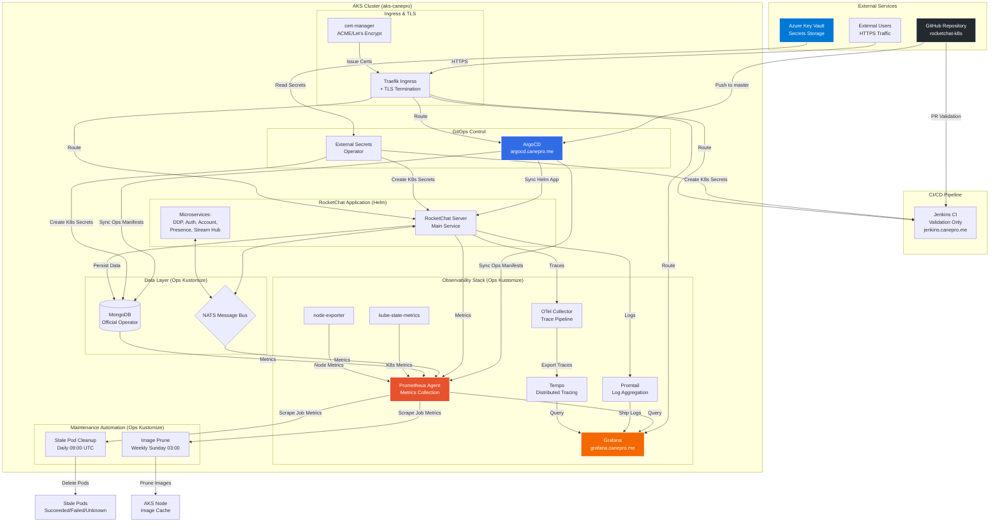
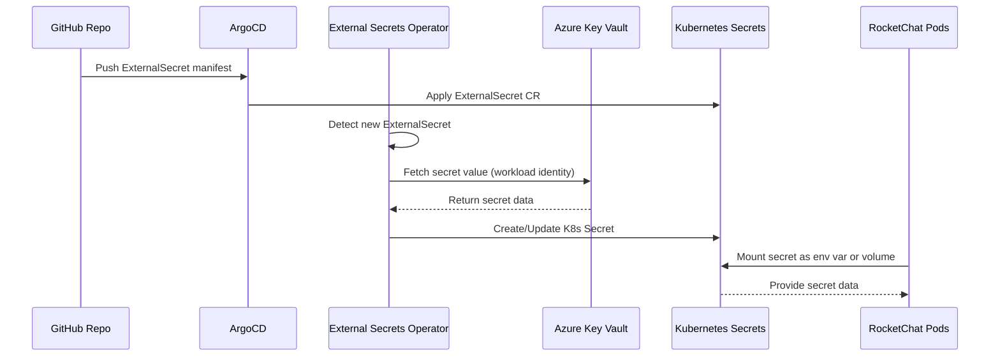

# RocketChat GitOps Architecture

This diagram visualizes the complete AKS-based GitOps architecture for RocketChat, including application services, infrastructure, secrets management, observability, and maintenance automation.

## 🏗️ High-Level Architecture



## 🔄 GitOps Workflow

1. **Developer Push**: Changes committed to `master` branch in GitHub
2. **ArgoCD Detection**: ArgoCD polls repository every 3 minutes (configurable)
3. **Sync Decision**: ArgoCD compares desired state (Git) vs actual state (K8s)
4. **Application Deployment**:
   - **Helm App**: `values.yaml` → RocketChat microservices
   - **Ops App**: `ops/kustomization.yaml` → Infrastructure manifests
5. **Secrets Injection**: ESO fetches secrets from Azure Key Vault → K8s Secrets
6. **CI Validation** (parallel): Jenkins validates PRs but doesn't deploy

## 📦 Application Split Pattern

This repository uses a **Split-App Pattern** for better separation of concerns:

### 1. RocketChat App (Helm)
- **File**: `values.yaml`
- **ArgoCD App**: `aks-rocketchat-helm`
- **Contents**: RocketChat server + microservices (DDP, Auth, Account, Presence, Stream Hub)
- **Update Trigger**: Change `image.tag` in `values.yaml`

### 2. Ops App (Kustomize)
- **Directory**: `ops/`
- **ArgoCD App**: `aks-rocketchat-ops`
- **Contents**:
  - Data layer (MongoDB, NATS)
  - Observability (Prometheus, Grafana, Promtail, Tempo, OTel)
  - Maintenance (CronJobs for cleanup)
  - Storage (PersistentVolumes)
  - TLS (ClusterIssuer for cert-manager)

### 3. Secrets App (Kustomize)
- **Directory**: `ops/secrets/`
- **ArgoCD App**: `aks-rocketchat-secrets`
- **Contents**: ExternalSecret manifests + ClusterSecretStore
- **Backend**: Azure Key Vault

### 4. Infrastructure Apps (Separate Repos)
- **Traefik**: `aks-traefik` (IngressController + TLS)
- **Jenkins**: `aks-jenkins` (CI validation)
- **MongoDB Operator**: `aks-rocketchat-mongodb-operator`
- **External Secrets Operator**: `aks-rocketchat-external-secrets`

## 🔐 Secrets Management Flow



**Key Secrets Managed via ESO**:
- `rocketchat-mongodb-external`: MongoDB connection string (`mongo-uri`)
- `mongodb-admin-password`: MongoDB admin credentials
- `mongodb-rocketchat-password`: MongoDB RocketChat user credentials
- `observability-credentials`: Grafana admin password
- `jenkins-credentials`: Jenkins admin + GitHub token

## 📊 Observability Architecture

The monitoring stack provides comprehensive visibility:

### Metrics Pipeline
```
Application Pods → ServiceMonitor → Prometheus Agent → Grafana Dashboards
                                                      ↓
                                                 Alert Rules
```

### Logs Pipeline
```
Application Pods → Promtail (DaemonSet) → Loki/Grafana → Log Browser
```

### Traces Pipeline
```
RocketChat → OTel Collector → Tempo → Grafana Trace UI
```

**Monitoring Endpoints**:
- Grafana: `https://grafana.canepro.me`
- ArgoCD: `https://argocd.canepro.me`
- Jenkins: `https://jenkins.canepro.me`

## 🧹 Automated Maintenance

Two CronJobs ensure cluster health:

1. **Stale Pod Cleanup** (`aks-stale-pod-cleanup`)
   - **Schedule**: Daily at 09:00 UTC (30 min after cluster auto-start)
   - **Purpose**: Remove Succeeded/Failed/Unknown pods after cluster restarts
   - **Dashboard**: "AKS Maintenance Jobs" in Grafana

2. **Image Prune** (`aks-maintenance-image-prune`)
   - **Schedule**: Weekly Sunday 03:00 UTC
   - **Purpose**: Clean unused container images from node cache
   - **Dashboard**: "AKS Maintenance Jobs" in Grafana

## 🌐 Network Flow

```
Internet
   ↓
Azure Load Balancer (Public IP)
   ↓
Traefik IngressController (NodePort/LoadBalancer)
   ↓
├─ rocketchat.canepro.me → RocketChat Service (ClusterIP)
├─ argocd.canepro.me → ArgoCD Server (ClusterIP)
├─ grafana.canepro.me → Grafana Service (ClusterIP)
└─ jenkins.canepro.me → Jenkins Service (ClusterIP)
```

**TLS Certificates**: Automatically issued via cert-manager + Let's Encrypt ACME

## 📚 Related Documentation

- **Operations**: [OPERATIONS.md](OPERATIONS.md) - Day-2 operations, upgrades, troubleshooting
- **Setup Summary**: [SETUP_SUMMARY.md](SETUP_SUMMARY.md) - Monitoring setup and dashboard details
- **Migration Status**: [MIGRATION_STATUS.md](MIGRATION_STATUS.md) - Current migration progress
- **Troubleshooting**: [TROUBLESHOOTING_DNS_TLS.md](TROUBLESHOOTING_DNS_TLS.md) - DNS & TLS issues
- **Jenkins Deployment**: [JENKINS_DEPLOYMENT.md](JENKINS_DEPLOYMENT.md) - CI/CD setup
- **Maintenance Monitoring**: [ops/MAINTENANCE_MONITORING.md](ops/MAINTENANCE_MONITORING.md) - CronJob monitoring
- **Versions**: [VERSIONS.md](VERSIONS.md) - Component version tracking
