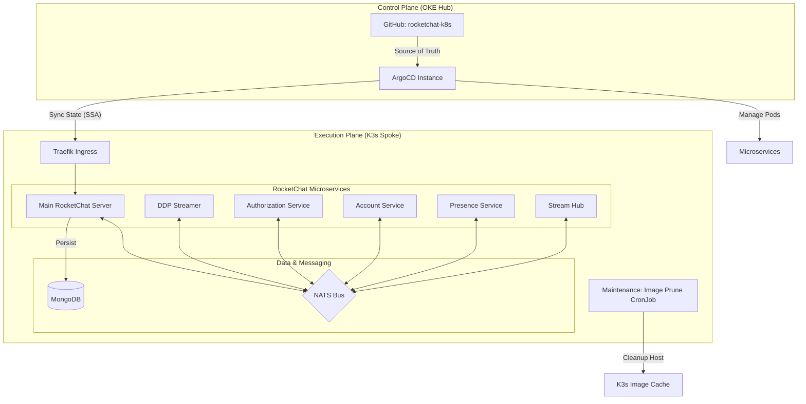

# RocketChat GitOps Architecture

This diagram visualizes how the OKE Hub (Control Plane) manages the K3s Spoke (Execution Plane) using ArgoCD and Kustomize.

```mermaid
graph TD
    subgraph "Control Plane (OKE Hub)"
        ArgoCD[ArgoCD Instance]
        GitRepo[GitHub: rocketchat-k8s]
    end

    subgraph "Execution Plane (K3s Spoke)"
        direction TB
        Ingress[Traefik Ingress]
        
        subgraph "RocketChat Microservices"
            Server[Main RocketChat Server]
            DDP[DDP Streamer]
            Auth[Authorization Service]
            Acc[Account Service]
            Pres[Presence Service]
            Hub[Stream Hub]
        end

        subgraph "Data & Messaging"
            Mongo[(MongoDB)]
            NATS{NATS Bus}
        end

        Cron[Maintenance: Image Prune CronJob]
    end

    %% GitOps Flow
    GitRepo -- "Source of Truth" --> ArgoCD
    ArgoCD -- "Sync State (SSA)" --> Ingress
    ArgoCD -- "Manage Pods" --> Microservices

    %% Internal Data Flow
    Ingress --> Server
    Server <--> NATS
    DDP <--> NATS
    Auth <--> NATS
    Acc <--> NATS
    Pres <--> NATS
    Hub <--> NATS
    
    Server -- "Persist" --> Mongo
    Cron -- "Cleanup Host" --> K3s_Node[K3s Image Cache]
```

