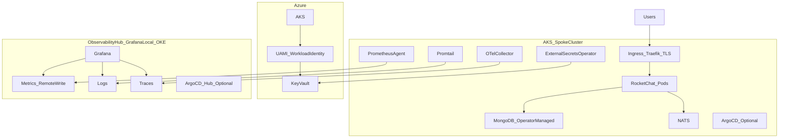

# Self-Healing Rocket.Chat Clusters (Terraform Module) — Project Plan

This document captures the near-future plan to create an open-source Terraform module for **self-healing Rocket.Chat clusters**, aligned with this repository’s **GitOps-first** approach (ArgoCD) and the existing **GrafanaLocal** observability hub.

## Scope & principles
- **Target platform (v1)**: **Azure AKS + Kubernetes-native self-healing** (not VMSS/ASG + cloud-init).
- **GitOps-first**: Terraform provisions **infrastructure + identity**; ArgoCD reconciles **workloads + operations** from Git.
- **Security-first**: secrets live in Azure Key Vault; clusters access via **ESO + Workload Identity**; least-privilege RBAC.
- **Future-proofing**: stable interfaces, clear docs, and automated validation/version-detection.

## High-level architecture (hub-and-spoke)

## Current state (what already exists and works)
This repo already demonstrates the core building blocks of the final “self-healing module”:

### GitOps apps & self-healing
- ArgoCD Applications are defined in `GrafanaLocal/argocd/applications/` and use automated sync with `selfHeal: true` (desired-state drift correction).

### Secrets management (already GitOps-managed)
- ESO helm deployment: `GrafanaLocal/argocd/applications/aks-rocketchat-external-secrets.yaml`
- GitOps secrets stack: `GrafanaLocal/argocd/applications/aks-rocketchat-secrets.yaml` → `ops/secrets/`
- ClusterSecretStore (Workload Identity → Key Vault): `ops/secrets/clustersecretstore-azure-keyvault.yaml`
- ExternalSecrets examples:
  - Mongo URIs: `ops/secrets/externalsecret-rocketchat-mongodb-external.yaml`
  - Observability creds: `ops/secrets/externalsecret-observability-credentials.yaml`

### Hub integration (metrics/logs/traces)
- Prometheus agent remote_write config: `ops/manifests/prometheus-agent-configmap.yaml`
- OTel Collector Tempo export config: `ops/manifests/otel-collector-configmap.yaml`
- Promtail Loki push config: `ops/manifests/promtail-configmap.yaml`

## The publishable outcome (new repo)
Create a **new, dedicated repo** (clean/open-source) that contains the Terraform module + examples + docs.

Recommended repo name (example): `terraform-azure-aks-rocketchat-self-healing`

### Why a new repo (best practice)
- Keeps this repo (`rocketchat-k8s`) as the **reference GitOps environment**.
- Allows a semver’ed module release cycle without coupling to live production GitOps changes.

## Terraform module boundary (what the module does vs does not do)

### Module DOES (infrastructure + identity)
- Azure Resource Group + network primitives (as needed)
- AKS cluster settings required for Workload Identity
- Managed identity (UAMI) for ESO access to Key Vault
- Azure Key Vault (default) OR reference an existing Key Vault (advanced)
- RBAC role assignments required for ESO to read secrets
- Outputs required for GitOps wiring (tenant id, vault URL, UAMI client id, cluster label)

### Module DOES NOT (workloads)
- Rocket.Chat chart values, MongoDB CRs, NATS, Prometheus/OTel/Promtail manifests
  - These remain in GitOps repos (this repo and the hub repo), applied by ArgoCD.

## Secrets strategy (early decision)
Better secrets management must be decided **up-front** because it affects: module interface, RBAC, ArgoCD/ESO wiring, and “no-breakage” operations.

### Default (easiest + least breakage): per-cluster Key Vault
- Terraform creates a Key Vault per cluster/environment.
- ESO reads secrets via Workload Identity.
- Lowest blast radius and simplest RBAC/auditing.

### Advanced: use an existing “platform” Key Vault (shared)
Supported and documented, but treated as advanced:
- Strictly **one identity per consumer** (per cluster/tool).
- Least privilege RBAC at the vault scope.
- Clear secret naming conventions to avoid collisions (prefix per cluster/environment).

## GitOps bootstrap paths (choose one per audience)
### Default (module consumers): ArgoCD installed in the spoke
- Install ArgoCD into the AKS cluster (Terraform may optionally assist via outputs; GitOps applies are still GitOps-first).
- ArgoCD points at this repo (or a fork) for Rocket.Chat + ops + secrets apps.

### Advanced (your platform): hub ArgoCD manages spokes
- Register AKS cluster into hub ArgoCD.
- Hub ArgoCD applies Applications that point to this repo for the spoke.

## Self-healing: what it means here (and how to prove it)
Self-healing is primarily achieved by **Kubernetes controllers + GitOps reconciliation**:
- **Pod/process failures**: restart and reschedule (kubelet + deployments/statefulsets).
- **Node failures**: AKS replaces nodes under the hood; workloads reschedule.
- **Config drift**: ArgoCD `selfHeal: true` recreates resources deleted/modified out-of-band.

### Health signal quality (important for credible automation)
Use the Rocket.Chat upstream work (PR #38192) as a supporting reference: better heap-limit based health metrics reduce false “pressure” signals, which makes automated recovery decisions more trustworthy.

## Observability requirements (hub-and-spoke proof)
Minimum “proof” signals:
- Restart counts / CrashLoopBackOff
- Replica availability (deployment/statefulset)
- ArgoCD app health (Synced/OutOfSync, Healthy/Degraded)
- Remote write health (Prometheus agent self-metrics)
- Trace export health (otelcol span counters, exporter errors)
- Optional: log ingestion volume / drop rate

Deliverable: a small **Self-Healing Events** dashboard + alert rules for these signals (hub-facing).

## Version detection + upgrade planning (automation)
Goal: automate **detection early**, automate **changes only when low-risk**.

### Module repo (GitHub Actions)
- Scheduled workflows + Renovate/Dependabot:
  - Auto-PRs for low-risk: providers, GitHub Actions, linters
  - CI gates required to merge

### Environment repos (Jenkins)
- Weekly scheduled job that:
  - Reads `VERSIONS.md` / `VERSION-TRACKING.md`
  - Compares against upstream releases
  - Creates a weekly “Upgrade Plan” issue (high-risk) and optional auto-PRs (pre-approved low-risk)

### Upgrade scheduling
- Document a monthly maintenance window, readiness checklist, and rollback plan template.

## CI quality gates (future-proofing)
### Module repo (GitHub Actions)
- `terraform fmt` / `terraform validate`
- `tflint`
- `tfsec` or `checkov`
- docs lint + link checks

### Environment repos (Jenkins validation-only)
- `terraform fmt -check`, `terraform validate`, `terraform plan` (no applies)
- `helm template`, `kubeconform`, YAML lint, policy checks

## Deliverables checklist
- **New module repo** with:
  - `modules/aks_spoke/`
  - `examples/production_spoke/` (per-cluster vault happy path)
  - `examples/existing_vault_spoke/` (advanced shared vault)
  - Docs:
    - `docs/ARCHITECTURE.md`
    - `docs/SELF_HEALING.md`
    - `docs/EVIDENCE.md`
    - `docs/SECRETS_AND_IDENTITY.md`
    - `docs/OPERATIONS.md`
    - `docs/SECURITY.md`
  - OSS meta: `LICENSE`, `CONTRIBUTING.md`, `CHANGELOG.md` (SemVer)
- **Reference implementation** remains here (`rocketchat-k8s`) and in the hub repo (`GrafanaLocal`).

