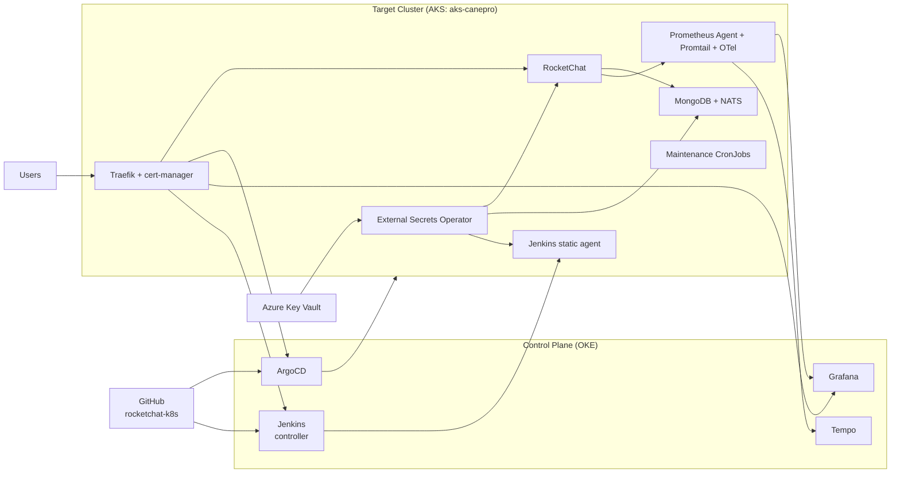
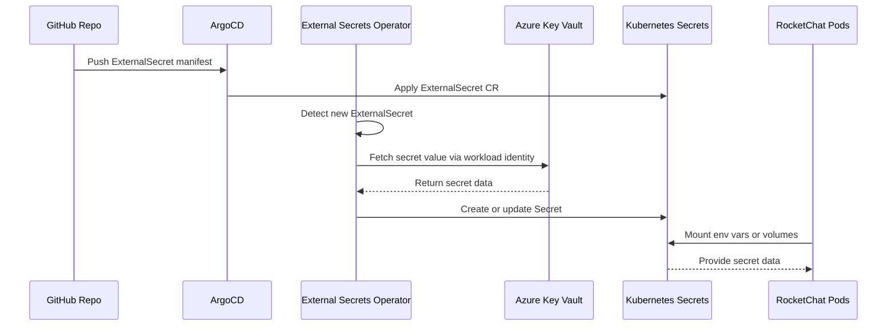
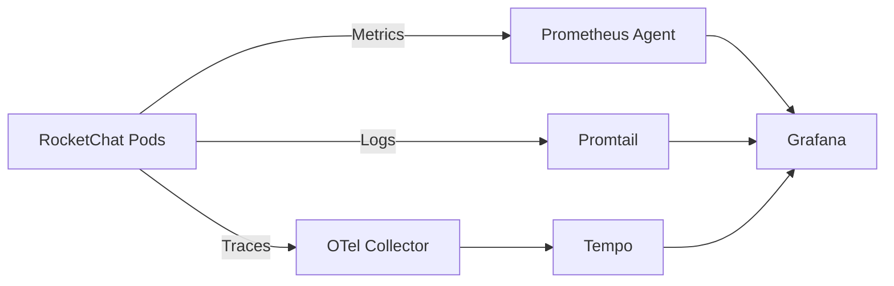

# RocketChat Kubernetes Platform

Production-grade Rocket.Chat deployment with an OKE-hosted control plane and an AKS-hosted workload cluster, managed through GitOps.

## Overview

This repository contains the complete infrastructure-as-code for deploying and operating Rocket.Chat at scale:

- **Application**: RocketChat monolith + microservices (account, authorization, presence, ddp-streamer)
- **Database**: MongoDB via Community Kubernetes Operator
- **Messaging**: NATS for microservices communication
- **Ingress**: Traefik with automatic TLS via cert-manager
- **Control Plane**: ArgoCD + Jenkins controller on OKE
- **Observability**: Prometheus, Grafana, Loki, Tempo (hosted on separate OKE hub cluster)
- **Secrets**: External Secrets Operator + Azure Key Vault
- **CI/CD**: ArgoCD (GitOps CD) + Jenkins (validation CI)

## Platform at a Glance

| Layer | Primary Components | Source of Truth |
|------|---------------------|-----------------|
| Control Plane | ArgoCD, Jenkins controller, Grafana, Tempo | OKE hub cluster + GitOps |
| Traffic & TLS | Traefik, cert-manager, public DNS | GitOps manifests + ArgoCD |
| Application | RocketChat Helm release, microservices | `values.yaml` |
| Data | MongoDB operator, NATS | `ops/` manifests |
| Secrets | External Secrets Operator, Azure Key Vault | `ops/secrets/` + Key Vault |
| Observability | Prometheus Agent, Promtail, OTel on AKS; Grafana/Tempo on OKE | `ops/` manifests |
| CI Validation | Jenkins on OKE + AKS static agent | `.jenkins/` + Jenkins GitOps |
| Delivery | ArgoCD split applications | `master` branch |

## Architecture


```mermaid
flowchart LR
  GitHub[GitHub<br/>rocketchat-k8s]
  AzureKV[Azure Key Vault]
  Users[Users]
  
  subgraph OKE["Control Plane (OKE)"]
    ArgoCD[ArgoCD]
    Jenkins[Jenkins<br/>controller]
    Grafana[Grafana]
    Tempo[Tempo]
  end

  subgraph AKS["Target Cluster (AKS: aks-canepro)"]
    ESO[External Secrets Operator]
    Edge[Traefik + cert-manager]
    RC[RocketChat]
    Data[MongoDB + NATS]
    Obs[Prometheus Agent + Promtail + OTel]
    Maint[Maintenance CronJobs]
    Agent[Jenkins static agent]
  end

  GitHub --> ArgoCD
  GitHub --> Jenkins
  AzureKV --> ESO
  ESO --> RC
  ESO --> Data
  ESO --> Agent
  Users --> Edge
  Edge --> RC
  Edge --> ArgoCD
  Edge --> Grafana
  Edge --> Jenkins
  ArgoCD --> AKS
  Jenkins --> Agent
  RC --> Data
  RC --> Obs
  Obs --> Grafana
  Obs --> Tempo
```

### GitOps Workflow

1. Changes land in `master`.
2. ArgoCD on OKE reconciles the split applications into the AKS target cluster.
3. ESO projects Key Vault values into Kubernetes Secrets.
4. RocketChat, ops manifests, and maintenance jobs converge from Git.
5. Jenkins validates pull requests through the AKS static agent, but does not deploy.

### Secrets Management Flow


```mermaid
sequenceDiagram
    participant Git as GitHub Repo
    participant ArgoCD as ArgoCD
    participant ESO as External Secrets Operator
    participant AKV as Azure Key Vault
    participant K8s as Kubernetes Secrets
    participant App as RocketChat Pods

    Git->>ArgoCD: Push ExternalSecret manifest
    ArgoCD->>K8s: Apply ExternalSecret CR
    ESO->>ESO: Detect new ExternalSecret
    ESO->>AKV: Fetch secret value via workload identity
    AKV-->>ESO: Return secret data
    ESO->>K8s: Create or update Secret
    App->>K8s: Mount env vars or volumes
    K8s-->>App: Provide secret data
```

### Signal Paths


```mermaid
flowchart LR
  App[RocketChat Pods] -->|Metrics| Prometheus[Prometheus Agent]
  App -->|Logs| Promtail[Promtail]
  App -->|Traces| OTel[OTel Collector]
  Prometheus --> Grafana[Grafana]
  Promtail --> Grafana
  OTel --> Tempo[Tempo]
  Tempo --> Grafana
```

For the full diagram set, including maintenance and network flow details, see [DIAGRAM.md](DIAGRAM.md).

## Quick Start

### Upgrade RocketChat Version

```bash
# 1. Edit values.yaml - change image.tag
vim values.yaml

# 2. Commit and push
git add values.yaml
git commit -m "chore: upgrade RocketChat to X.Y.Z"
git push origin master
```

ArgoCD automatically syncs changes within 3 minutes.

### Manual Cluster Operations

```bash
# Start cluster (if stopped)
az aks start --resource-group rg-canepro-aks --name aks-canepro

# Stop cluster
az aks stop --resource-group rg-canepro-aks --name aks-canepro

# Check cluster status
az aks show --resource-group rg-canepro-aks --name aks-canepro --query powerState
```

## AKS system nodepool recovery and Terraform state

- Incident: AKS resources were impacted after Azure subscription credit exhaustion/suspension.
- Recovery: the system nodepool `system2` was created and the old `system` pool was deleted to restore cluster operation.
- IMPORTANT: Terraform state must be reconciled manually later in an environment that has backend access.
- Import target resource ID for `system2` (for later manual state reconciliation):
  `/subscriptions/1c6e2ceb-7310-4193-ab4d-95120348b934/resourceGroups/rg-canepro-aks/providers/Microsoft.ContainerService/managedClusters/aks-canepro/agentPools/system2`
- Backend auth uses Azure/Key Vault, so state operations must be run from the approved operator environment.

## Repository Structure

```
.
├── values.yaml                 # RocketChat Helm values (versions, scaling, config)
├── ops/
│   ├── kustomization.yaml      # Kustomize entrypoint for ops manifests
│   ├── manifests/              # Raw K8s manifests (PVCs, monitoring, maintenance)
│   └── secrets/                # ExternalSecret definitions (GitOps secrets)
├── terraform/                  # AKS infrastructure + automation schedules
├── .jenkins/                   # CI pipeline definitions
├── OPERATIONS.md               # Day-2 operations runbook
├── JENKINS_DEPLOYMENT.md       # Jenkins setup + runbook
├── VERSIONS.md                 # Component version tracking
├── DIAGRAM.md                  # Architecture diagrams
└── TROUBLESHOOTING_DNS_TLS.md  # DNS/TLS troubleshooting
```

## GitOps Model

This repository follows a **Split-App Pattern** with ArgoCD:

| Application | Source | Manages |
|-------------|--------|---------|
| `aks-rocketchat-helm` | `values.yaml` | RocketChat application stack |
| `aks-rocketchat-ops` | `ops/` | Infrastructure (storage, monitoring, jobs) |
| `aks-rocketchat-secrets` | `ops/secrets/` | External Secrets definitions |

**Deployment Flow**:
1. Commit changes to `master` branch
2. ArgoCD detects changes (3-min sync interval)
3. ArgoCD applies changes to cluster
4. Rollback via `git revert` if needed

## Configuration

### Key Files

| File | Purpose |
|------|---------|
| `values.yaml` | RocketChat version, replicas, resources, feature flags |
| `ops/manifests/mongodb-community.example.yaml` | MongoDB cluster configuration |
| `terraform/variables.tf` | Infrastructure parameters |
| `jenkins-values.yaml` | Jenkins Helm configuration |

### Secrets Management

Secrets are managed via GitOps using External Secrets Operator and Azure Key Vault:

```yaml
# ops/secrets/externalsecret-example.yaml
apiVersion: external-secrets.io/v1beta1
kind: ExternalSecret
metadata:
  name: rocketchat-mongodb
spec:
  secretStoreRef:
    name: azure-keyvault
    kind: ClusterSecretStore
  target:
    name: rocketchat-mongodb
  data:
    - secretKey: mongo-uri
      remoteRef:
        key: rocketchat-mongodb-uri
```

**Never commit secrets to this repository.** Store values in Azure Key Vault.

**Primary secret paths**:
- RocketChat and MongoDB credentials
- Grafana and observability credentials
- Jenkins admin, GitHub token, and PipelineHealer bridge credentials

## Operations

### Monitoring

| Service | URL |
|---------|-----|
| ArgoCD | https://argocd.canepro.me |
| Grafana | https://grafana.canepro.me |
| Jenkins | https://jenkins.canepro.me |
| RocketChat | https://k8.canepro.me |

### Cost Optimization

The cluster runs on an automated schedule to minimize costs:

- **Runtime**: Weekdays 13:30-16:15 Europe/London (~2.75 hours/day)
- **Monthly Hours**: ~55 hours
- **Reasoning**: enough startup buffer for Argo resync plus a short working window on a personal PAYG budget

Schedule is managed via Terraform in `terraform/automation.tf`.

### Maintenance Jobs

| Job | Schedule | Purpose |
|-----|----------|---------|
| `k3s-image-prune` | Sunday 03:00 UTC | Remove unused container images |
| `aks-stale-pod-cleanup` | Every 4 hours at :30 UTC (`30 */4 * * *`) | Clean up pods after cluster restart |

## CI/CD Pipeline

### Jenkins (Validation)

Jenkins performs CI validation on pull requests:

- Terraform: `fmt -check`, `validate`, `plan`
- Helm: `template` + `kubeconform`
- YAML: `yamllint`
- Security: `tfsec`, `checkov`, `trivy`

This repo also runs two scheduled automation jobs that report to GitHub so you don’t have to check Jenkins daily:
- **Version updates**: `.jenkins/version-check.Jenkinsfile`; breaking issue + non-breaking PR (de-duped); uses secure Git push and workspace-scoped git commands.
- **Security validation**: `.jenkins/security-validation.Jenkinsfile`; issue/PR updates (de-duped).

See:
- [.jenkins/VERSION_CHECKING.md](.jenkins/VERSION_CHECKING.md)
- [.jenkins/SECURITY_VALIDATION.md](.jenkins/SECURITY_VALIDATION.md)

### ArgoCD (Deployment)

ArgoCD handles all deployments via GitOps:

- Auto-sync enabled on `master` branch
- Self-heal enabled (drift correction)
- Prune enabled (remove orphaned resources)

## Documentation

| Document | Description |
|----------|-------------|
| [OPERATIONS.md](OPERATIONS.md) | Day-2 operations, upgrades, troubleshooting |
| [DIAGRAM.md](DIAGRAM.md) | Architecture and data flow diagrams |
| [VERSIONS.md](VERSIONS.md) | Component version tracking |
| [JENKINS_DEPLOYMENT.md](JENKINS_DEPLOYMENT.md) | Jenkins setup and configuration |
| [TROUBLESHOOTING_DNS_TLS.md](TROUBLESHOOTING_DNS_TLS.md) | DNS and TLS troubleshooting |
| [MIGRATION_STATUS.md](MIGRATION_STATUS.md) | Migration progress tracking |
| [terraform/README.md](terraform/README.md) | Infrastructure documentation |
| [.jenkins/README.md](.jenkins/README.md) | Jenkins pipelines overview |

## Prerequisites

- Azure CLI with AKS credentials
- `kubectl` configured for the cluster
- Git access to this repository

For emergency access or initial setup, see [OPERATIONS.md](OPERATIONS.md).

## Contributing

1. Create a feature branch from `master`
2. Make changes and test locally where possible
3. Submit a pull request
4. Jenkins validates the changes
5. Merge to `master` triggers ArgoCD deployment

## License

See [LICENSE](LICENSE) for details.
